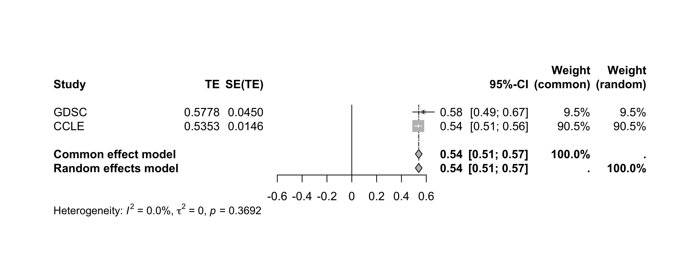

# Module 4: Pharmacogenomics for Biomarker Discovery - Advanced Analysis

## Lecture

<iframe width="640" height="360" src="https://www.youtube.com/embed/r73hywi6a48?si=uT41HDlpt0GRmH1K" title="YouTube video player" frameborder="0" allow="accelerometer; autoplay; clipboard-write; encrypted-media; gyroscope; picture-in-picture; web-share" referrerpolicy="strict-origin-when-cross-origin" allowfullscreen></iframe>

<br>

<iframe src="https://drive.google.com/file/d/1iuzxJENmCwG6X1ymU9Qnf_5Gw011YXDv/preview" width="640" height="480" allow="autoplay"></iframe>

## Lab

### Overview

#### Intructor(s) Name and Contact Information

* Nikta Feizi <nikta.feizi@uhn.ca>
* Julia Nguyen <julia.nguyen@uhn.ca>

#### Introduction

This workshop will touch on more advanced statistical methods for univariate biomarker discovery. It will primarily cover meta-analysis techniques and sub-group analysis.

##### Learning Objectives

By the end of this lab, participants will be able to:

* Execute a meta-analysis using multiple PharmacoSets to evaluate a biomarker of interest across different cancer types
* Generate and interpret forest plots to visualize effect sizes
* Perform subgroup analyses using a small subset of the CCLE dataset
* Understand the preprocessing steps required for pharmacogenomic data
* Assess the assumptions and model diagnostics for linear regression models

```{r load_packages_4, eval=TRUE, echo=FALSE, include=FALSE}
suppressPackageStartupMessages({
  library(CBWWorkshop2024)
  library(PharmacoGx)
  library(meta)
  library(ggplot2)
  library(ggpubr)
  library(dplyr)
  library(survcomp)
})
```

### Data Acquisition and Preparation

Like before, we will use smaller versions of the PharmacoSets for the workshop to minimize
processing time. Let's load these datasets in and subset for common cell lines and .
```{r load-datasets}
# load in the datasets
data("GDSCsmall")
data("CCLEsmall")
```

#### Extracting Required Vectors for Biomarker Analysis

Recall there are two components needed for a biomarker association analysis:

* Feature data (molecular profile)
* Drug response

Say we are interested in `ENSG00000003987` expression association with `PD-0325901`. We can start by extracting this data from both PSets.

##### Gene Expression Data
```{r get_expression_data, message=FALSE, warning=FALSE}
# specify our gene of interest
gene <- "ENSG00000003987"


# extract the RNA-Seq data for our gene of interest in both GDSC and CCLE
ccle_rna_data <- summarizeMolecularProfiles(
  CCLEsmall,
  mDataType = "rna", features = gene
) |> assay()

gdsc_rna_data <- summarizeMolecularProfiles(
  GDSCsmall,
  mDataType = "rna", features = gene
) |> assay()
gdsc_rna_data
```

##### Drug Response Data

Next, let's take a look at the available drug response data
```{r preview_drug_response, message=FALSE, warning=FALSE}
sensitivityProfiles(CCLEsmall) |> head()
```

We can see a few options of drug response metrics to choose from. We will use `auc_published` for our drug response associations.
```{r extract_AUC_published, message=FALSE, warning=FALSE}
# extract AUC_published data from CCLE and GDSC
ccle_auc <- summarizeSensitivityProfiles(
  CCLEsmall,
  sensitivity.measure = "auc_published",
  summary.stat = "median",
  verbose = FALSE
)

gdsc_auc <- summarizeSensitivityProfiles(
  GDSCsmall,
  sensitivity.measure = "auc_published",
  summary.stat = "median",
  verbose = FALSE
)

ccle_auc[1:5,1:5]
```

The `summarizeSensitivityProfiles()` function nicely pulls the drug response data and converts it into a sample~drug matrix for easy use.

We only need the drug response data for `PD-0325901`, so let's pull that out.
```{r extract_drug_data, message=FALSE, warning=FALSE}
drug <- "PD-0325901"
ccle_drug_data <- ccle_auc[drug, ]
gdsc_drug_data <- gdsc_auc[drug, ]

head(ccle_drug_data)
head(gdsc_drug_data)
```


#### Gene Expression Exploratory Data Analysis (EDA)

Before performing the statistical analysis, let's quickly look at the distribution of `ENSG00000003987` expression data.

First, we can check the number of cell lines in each vector:
```{r get_data_EDA, message=FALSE, warning=FALSE}
paste("Number of cell lines in GDSC:", length(gdsc_rna_data))
paste("Number of cell lines in CCLE:", length(ccle_rna_data))
```

Notice there is a large difference between the number of samples between GDSC and CCLE. This difference in sample size may reflected in the meta-analysis.

Let's quickly look at the distribution of this gene in both PSets.
```{r plot_EDA, message=FALSE, warning=FALSE}
p1 <- ggplot(data = t(ccle_rna_data), aes_string(x = gene)) +
        geom_histogram(bins = 30, fill = "skyblue", color = "black") +
        labs(
          title = stringr::str_c("Distribution of ", gene, " Expression in CCLEsmall"),
          x = "Expression", y = "Frequency"
        )
p2 <- ggplot(data = t(gdsc_rna_data), aes_string(x = gene)) +
        geom_histogram(bins = 30, fill = "skyblue", color = "black") +
        labs(
          title = stringr::str_c("Distribution of ", gene, " Expression in GDSCsmall"),
          x = "Expression", y = "Frequency"
        )
ggarrange(p1, p2, ncol = 2)
```

Notice that the difference in distribution shapes. You can imagine what implications a small sample size (e.g. GDSC) would have when downstream analysis.

#### Effect Size Calculation
In this next section, we will compute the associations between our feature and drug within each individual PSet. These results will be what we input into the meta-analysis.

Before we start, let's confirm that the samples in our input `ENSG00000003987` expression and `PD-0325901` response vectors are in the samae order.
```{r check_input_order, message=FALSE, warning=FALSE}
table(names(gdsc_drug_data) == colnames(gdsc_rna_data))
table(names(ccle_drug_data) == colnames(ccle_rna_data))

# manually look at the cell line names
names(gdsc_drug_data)
colnames(gdsc_rna_data)
```

We can use any of the statistical methods discussed in Module 3 to calculate theeffect size of the association between `ENSG00000003987` expression and `PD-0325901` response.

Let's try using concordance index:
```{r compute_ci}
# fixing drug response data (to change in subsetted PSet)
gdsc_drug_data[3] <- 0.1

# compute concordance index for each pset
CCLE_ci <- survcomp::concordance.index(
  as.numeric(ccle_drug_data),                   # drug vector
  surv.time = as.numeric(ccle_rna_data),        # gene vector
  surv.event = rep(1,length(ccle_rna_data)),   
  outx = TRUE, method="noether", na.rm = TRUE
)

cat("Concordance Index:", CCLE_ci$c.index, "\n",
    "P-value:", CCLE_ci$p.value, "\n",
    "Standard Error:", CCLE_ci$se, "\n", 
    "Upper CI:", CCLE_ci$upper,"\n",
    "Lower CI:", CCLE_ci$lower)

GDSC_ci <- survcomp::concordance.index(
  as.numeric(gdsc_drug_data),                   # drug vector
  surv.time = as.numeric(gdsc_rna_data),        # gene vector
  surv.event = rep(1,length(gdsc_rna_data)),   
  outx = TRUE, method="noether", na.rm = TRUE
)

cat("Concordance Index:", GDSC_ci$c.index, "\n",
    "P-value:", GDSC_ci$p.value, "\n",
    "Standard Error:", GDSC_ci$se, "\n", 
    "Upper CI:", GDSC_ci$upper,"\n",
    "Lower CI:", GDSC_ci$lower)
```

#### Perform Meta-Analysis

Now we can combine the effect sizes from `GDSCsmall` and `CCLEsmall` to perform a meta-analysis.

Recall from the lecture that we need three variables for our meta-analysis:

* Effect Size (also called Treatment Effect or TE)
* Standard Error
* Dataset Labels (just for plotting purposes)

Let's extract all of this information from our outputs above and put it into a dataframe.
```{r combine_results}
combined <- data.frame(
  Concordance.Index = c(GDSC_ci$c.index, CCLE_ci$c.index),
  Standard.Error = c(GDSC_ci$se, CCLE_ci$se),
  Upper.CI = c(GDSC_ci$upper, CCLE_ci$upper),
  Lower.CI = c(GDSC_ci$lower, CCLE_ci$lower),
  Dataset = c("GDSC", "CCLE")
)

combined
```

Now we can use the `metagen` function from the `meta` package to perform the meta-analysis. 
```{r meta_analysis}
meta.result <- metagen(data = combined,
  TE = Concordance.Index,
  seTE = Standard.Error,
  studlab = combined$Dataset
)

meta.result
```

##### Visualization with Forest Plots

###### Forest Function from Meta Package

We can use the built in `forest` function from the `meta` package to quickly create a forest plot using the output of the `metagen` function:
```{r simple_forest_plot}
# set your file path
file_path <- "forest_plot.png"

# generate forest plot
png(file = file_path, width = 10, height = 4, res = 600, units = "in")
forest(meta.result)
dev.off()
```


###### Using ggplot2

We can also visualize this data usign the `ggplot2` package. While this will not return a full forest plot, we can get a closer look at the relationship between the effect sizes of each individual dataset and the meta-estimate.
```{r ggplot_forest_plot}
ggplot(combined, aes(x = Concordance.Index, y = Dataset)) +
  geom_point(size = 3) +
  geom_errorbarh(aes(xmin = Lower.CI, xmax = Upper.CI), height = 0.2) +
  geom_vline(xintercept = meta.result$TE.random, linetype = "dashed", color = "red") +
  labs(
    title = "Meta-Analysis of GeneX Expression and Drug Response",
    x = "Effect Size",
    y = "Study"
  ) +
  theme_minimal()
```

In the plot above, we have each data point representing the individual dataset effect sizes, the error bars represents the confidence interval, and the vertical line representing the meta-analysis treatment estimate.

We can very clearly see that the red line is closer to the CCLE data point compared to the GDSC data point. This is reflective of the CCLE having a greater weight dueto a lower variance among other considerations.

#### Subgroup Analysis

We will now conduct a tissue-subgroup analysis using a subset of the `CCLEsmall` dataset, using all the steps that we have learned from this workshop.

We will be looking at the response of RNA-Seq data on AUC drug response. We will take a discovery approach, looking for any associations in our rich dataset.

##### Data Preparation

Let's start by loading in and looking at our data.
```{r load_ccle_data}
# load in expression data
expr <- summarizeMolecularProfiles(CCLEsmall, mDataType='rna') |> assay()
expr[1:5,1:5]

# load in drug response data
auc <- summarizeSensitivityProfiles(
  CCLEsmall,
  sensitivity.measure = "auc_published",
  summary.stat = "median",
  verbose = FALSE
)
auc[1:5,1:5]
```

We have our RNA-Seq expression and drug response matrix in the feature~sample format.

Next, let's load in the metadata for the cell lines.
```{r load_ccle_metadata}
# load in metadata
meta <- CCLEsmall@molecularProfiles[["rna"]] |> colData()
colnames(meta)
```

Since we want to do a tissue subgroup analysis, we need to identify the variable that gives us the tissue type for each cell line.

We also need to find the variable that maps to the column names of our `expr` matrix. Then, we make sure that all our samples are present in this metadata
```{r subset_metadata}
# show needed column names
meta[,c('Cell.line.primary.name', 'Site.Primary')] |> head()

# check for cell lines included in metadata
colnames(expr) %in% meta$Cell.line.primary.name |> table()
```

Notice we have some cell lines not included in the metadata. We will want to remove these samples from our analysis as we cannot give them a tissue label.
```{r subset_samples}
# identify cell lines with both expression and metadata
commonCells <- intersect(colnames(expr), meta$Cell.line.primary.name)
paste("Number of common cell lines:", length(commonCells))

# check that all these cell lines also have drug response data
commonCells %in% colnames(auc) |> table()

# subset metadata to only include these samples
meta <- meta[meta$Cell.line.primary.name %in% commonCells,]
dim(meta)
```

There were 936 cell lines with all RNA-Seq expression, drug response, and metadata. We only keep the metadata for these cell lines.

Next, let's take a look at the tissue types available within the samples we have.
```{r tissue_distribution}
meta$Site.Primary |> table()
```

We have a large range of different tissue types represented in our CCLE dataset. Let's select `haematopoietic_and_lymphoid_tissue` and `lung` tissues as they have the largest sample sizes.

Let's subset our PSets for each of these tissue types.
```{r subset_by_tissue}
# get cell lines from each tissue
lymp_cells <- meta$Cell.line.primary.name[meta$Site.Primary == "haematopoietic_and_lymphoid_tissue"]
lung_cells <- meta$Cell.line.primary.name[meta$Site.Primary == "lung"]

# subset psets to only include cells within each tissue group
lymp_pset <- subsetTo(CCLEsmall, cells = lymp_cells)
lung_pset <- subsetTo(CCLEsmall, cells = lung_cells)

# quickly check dimensions of the assays in our subsetted psets
assay(summarizeMolecularProfiles(lymp_pset, mDataType='rna')) |> dim()
```

All our molecular profiles and drug response data within each tissue-specific pset is now subsetted to only include the cell lines that are in the respective tissue.

##### Statistical Analysis to Measure Drug Response Associations

Let's say we want to discover a gene (biomarker) that is predictive of response to the drug `lapatinib`. To do that, we will compute the association between the expression of each gene to the lapatinib drug response.

First, let's get our assays:
```{r get_assays_dr}
# extract the expression assays
lymp_expr <- assay(summarizeMolecularProfiles(lymp_pset, mDataType='rna'))
lung_expr <- assay(summarizeMolecularProfiles(lung_pset, mDataType='rna'))

# extract the drug response assays
lymp_auc <- summarizeSensitivityProfiles(lymp_pset, sensitivity.measure = "auc_published",
                    summary.stat = "median", verbose = FALSE)
lung_auc <- summarizeSensitivityProfiles(lung_pset, sensitivity.measure = "auc_published",
                    summary.stat = "median", verbose = FALSE)

# extract just the drug response vector for lapatinib
drug <- "lapatinib"

lymp_auc <- lymp_auc[drug,]
lung_auc <- lung_auc[drug,]


# quickly view the data
lymp_expr[1:5,1:5]
lymp_auc[1:5]
```

The PSet has already ensured that the cell line order between the RNA-Seq expression matrix and the drug response vector is the same. Don't forget to always check when working with your own data.

Now we will have to compute the association between each gene to lapatinib. We can use a for loop to quickly do this:
```{r compute_drug_response}
# create data frame to hold results
results <- as.data.frame(matrix(data = NA, nrow = 0, ncol = 7))
colnames(results) <- c("gene", "drug", "ci", "pvalue", "se", "upper", "lower")

# get the number of genes (features)
num_genes <- nrow(lymp_expr)

# loop through every gene to compute concordance index to drug responses
for (gene in rownames(lymp_expr)) {
  
  # compute concordance index
  ci <- survcomp::concordance.index(
            as.numeric(lymp_auc),                   # drug vector
            surv.time = as.numeric(lymp_expr[gene,]),       # gene vector
            surv.event = rep(1,length(lymp_expr[gene,])),   
            outx = TRUE, method="noether", na.rm = TRUE
          )
  
  # extract summary statistics
  gene_result <- data.frame(gene, drug, 
                            ci = ci$c.index,
                            pvalue = ci$p.value,
                            se = ci$se,
                            upper = ci$upper,
                            lower = ci$lower)
  
  # merge with results dataframe
  results <- rbind(results, gene_result)
}

# filtering and multiple test correction
results <- results[complete.cases(results$pvalue),]
results$FDR <- p.adjust(results$pvalue, method = "BH", n = length(results$pvalue))

results |> head()
```

Notice at the end we also computed the false discovery rate (FDR) which is a method for multiple test correction.

We would have to repeat this code for every tissue type. Although we are only working with two, imagine we wanted to do more tissue types in the future.

###### Function for computing concordance index

To simply this, we can turn the code above into a function such that we just have to input the expression matrix and drug response vector to get our result without having to change the rest of the code.
 
Below is a function named `compute_CI` which takes two arguments:

* `expr`: an expression matrix with features as rows and samples as columns
* `drug_vector`: a vector of drug response in the same order as the samples in expr
* `drug`: string name of drug (just for putting in the results dataframe)

```{r compute_drug_response_function}
compute_CI <- function(expr, drug_vector, drug) {
  
  
  # create data frame to hold results
  results <- as.data.frame(matrix(data = NA, nrow = 0, ncol = 7))
  colnames(results) <- c("gene", "drug", "ci", "pvalue", "se", "upper", "lower")
  
  # get the number of genes (features)
  num_genes <- nrow(expr)
  
  # loop through every gene to compute concordance index to drug responses
  for (gene in rownames(expr)) {
    
    # compute concordance index
    ci <- survcomp::concordance.index(
              as.numeric(drug_vector),                   # drug vector
              surv.time = as.numeric(expr[gene,]),       # gene vector
              surv.event = rep(1,length(expr[gene,])),   
              outx = TRUE, method="noether", na.rm = TRUE
            )
    
    # extract summary statistics
    gene_result <- data.frame(gene, drug, 
                              ci = ci$c.index,
                              pvalue = ci$p.value,
                              se = ci$se,
                              upper = ci$upper,
                              lower = ci$lower)
    
    # merge with results dataframe
    results <- rbind(results, gene_result)
  }
  
  # filtering and multiple test correction
  results <- results[complete.cases(results$pvalue),]
  results$FDR <- p.adjust(results$pvalue, method = "BH", n = length(results$pvalue))
  results$FDRsig <- ifelse(results$FDR < 0.05, 'FDR Sig', 'Not FDR Sig')
  
  # output results
  return(results)
}

# use this function on both our lymp and lung data
lymp_results <- compute_CI(expr = lymp_expr, drug_vector = lymp_auc, drug = drug)
lung_results <- compute_CI(expr = lung_expr, drug_vector = lung_auc, drug = drug)

lymp_results |> head()
```

We also added a column called `FDRsig` which represents if the association met the FDR < 5% threshold. This will help us in plotting.


###### Visualizing Feature-drug Associations

Now that we have the associations between all our genes with lapatinib response for both our tissue groups, let's visualize the distribution of the computed associations.

Let's first rank by concordance index.
```{r rank_results}
lymp_results <- lymp_results[order(lymp_results$ci),]
lung_results <- lung_results[order(lung_results$ci),]

lymp_results |> head()
```

Next, we will create a waterfall plot. We've created a function to do so, the function is named `plot_waterfall` and takes the following arguments:

* `ci_results`: results matrix from the `compute_CI` function
* `tissue`: string of the tissue type

```{r waterfall_plot}
# create palette
pal <- c('FDR Sig' = "#B1D3A3", 'Not FDR Sig' = "gray")

# function to plot waterfall plots
plot_waterfall <- function(ci_results, tissue) {
  
  # minor formating for plotting
  ci_results$rank <- 1:nrow(ci_results)
  ci_results$rank <- as.factor(ci_results$rank)
  ci_results$drug <- as.factor(ci_results$drug)
  
  # create waterfall plot
  ggplot(ci_results, aes(x = ci - 0.5, y = rank)) +
    geom_col(aes(fill = FDRsig), color = "black") + 
    scale_x_continuous(limits = c(-0.5, 0.5), labels = function(x) x + 0.5) +
    scale_y_discrete(breaks = ci_results$rank, labels = ci_results$gene) + 
    geom_vline(xintercept = 0) +
    scale_fill_manual("FDR Significance", values = pal) + 
    theme_classic() + 
    theme(axis.text.x = element_text(angle = 90, hjust = 1)) + 
    labs(y = "Gene", title = tissue, x = "Concordance Index (CI)") +
    coord_flip()
}

# call the function on our lymp and lung results
plot_waterfall(lymp_results, 'Haematopoietic & Lymphoid')
plot_waterfall(lung_results, 'Lung')
```


Notice that there are no FDR significant associations within the lymp data, but there are some from the lung data. 

If you inspect closely, you can also see that the genes with the most predictive power (low and high CI values) are different between the two tissue types.

###### Identifying candidate biomarkers

We see some FDR significant associations in our lung data. Let's extract those genes.
```{r get_FDRsig_associations}
lung_sig <- lung_results[lung_results$FDR < 0.05,]
lung_sig
```

There are 6 genes that have FDR significant associations with lapatinib response. Of these 6, the most predictive is `ENSG00000000003` which is associated with resistance (CI < 0.5).

A next possible step would be to take some of these genes and assess their association in lung tissue-derived cell lines from another PSet (do a meta-analysis!)

#### Interactive Exercise

**Task1:** Compare the fixed-effects and random-effects models using the effect
sizes using a new gene-drug pair. Examine the variability across different the 
two studies. Use the I² and Q-statistics to assess heterogeneity.

```{r task1}
# perform meta analysis on GDSC and CCLE on a new gene-drug pair

# Once you have your meta.result, you can use the code below to examine the Q and I-squared statistics

#cat("Q Statistic:", meta.result$Q, "\n")
#cat("I-squared Statistic:", meta.result$I2, "%\n")
```

**Task2**: Perform a subgroup analysis on a new tissue type.

```{r task2}
# do a tissue subtype analysis on a new tissue type, reporting any candidate biomarkers
```

:::: {.callout type="green" title="Lab Completed!"}

Congratulations! You have completed Lab 4!

::::
